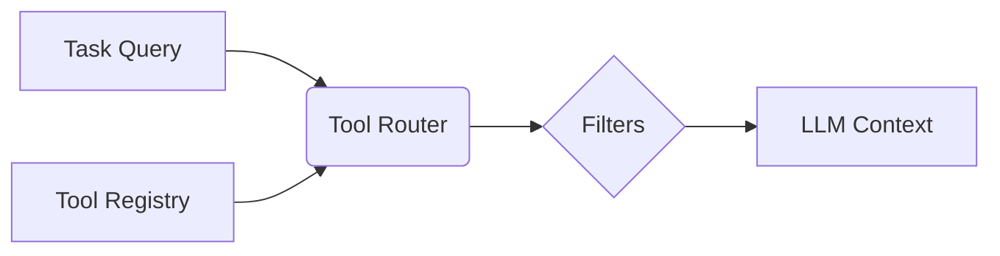

# PyPI Gift Batch — Tier-1 Source (2026-08-12)

This digest is the operator-curated bundle of 16 PyPI packages dropped
into `/workspace/attachments/` on 2026-08-12 (Christmas batch + a follow-up
drop the same day). All 16 were verified live on https://pypi.org via AION's
`pypi.lookup` skill at the same versions in this document. The operator
message accompanying the gifts was "digest ingest and install all".

## How to read this document

Per-package section contains:
- `[STATUS]` (live on PyPI, installable in DO basic image, size class, AION-relevance 0-3)
- `pip install` command
- README (truncated to first 4000 chars)
- SKILL.md (if shipped with the package — only browser-automation-cli ships one)
- AGENTS.md / CLAUDE.md (if shipped — for agent-aware packages)
- CHANGELOG.md (first 30 lines, for context)

## AION-relevance scoring

- 0 = standalone, no overlap with AION's product surface
- 1 = useful as a reference but not a runtime dep
- 2 = could plausibly slot into AION's stack with adapter
- 3 = directly relevant to AION's tool router / RAG / skill system

## Verdict map

- `fastapi-rag==0.1.1` — ✓ install — AION-relevance 1/3- `browser-automation-cli==0.2.1` — ⚠ opt-in — AION-relevance 3/3- `evolvishub-text-classification-llm==1.1.0` — ⚠ opt-in — AION-relevance 1/3- `facebook-scraper==0.2.59` — ✓ install — AION-relevance 0/3- `linkedin-scraper==3.1.2` — ⚠ opt-in — AION-relevance 0/3- `igramscraper==0.3.5` — ✓ install — AION-relevance 0/3- `finance-data-llm==0.1.13` — ⚠ opt-in — AION-relevance 0/3- `fluxflow-training==0.8.1` — ⚠ opt-in — AION-relevance 0/3- `instagram-posts-scraper==0.1.0` — ⚠ opt-in — AION-relevance 0/3- `exocortex-llm-router==0.1.1` — ✓ install — AION-relevance 3/3- `agentpack-skills==0.1.0` — ✓ install — AION-relevance 2/3- `agent-tool-router==0.4.0` — ✓ install — AION-relevance 3/3- `tool-router-ai==0.3.0` — ✓ install — AION-relevance 2/3- `semantic-tool-router==0.3.0` — ✓ install — AION-relevance 3/3- `how-agentic==0.1.1` — ✓ install — AION-relevance 2/3- `isage-agentic==0.1.0.5` — ✓ install — AION-relevance 3/3
---

## fastapi-rag==0.1.1

**[✓ live on PyPI, ✓ installable, AION-relevance 1/3]**

- **Summary:** CLI tool for generating production-ready FastAPI RAG backend templates
- **PyPI:** https://pypi.org/project/fastapi-rag/
- **Install:** `pip install fastapi-rag==0.1.1`

### README (README.md)

```
# FastAPI RAG: Enterprise AI Backend Generator

[](https://pypi.org/project/fastapi-rag/)
[](https://pypi.org/project/fastapi-rag/)
[](https://opensource.org/licenses/MIT)
[](https://github.com/example/fastapi-rag/actions)

**FastAPI RAG** is a sophisticated CLI tool designed to scaffold production-grade AI backends. Instead of assembly-required boilerplates, it generates a complete, modular ecosystem for RAG (Retrieval-Augmented Generation) applications, specialized AI agents, and high-performance SaaS platforms.

---

## 🌟 Why FastAPI RAG?

In the era of AI, the backend is more than just an API—it's an orchestrator. This tool generates a foundation that handles the complex "plumbing" of AI systems so you can focus on your domain logic.

*   **Intelligent Orchestration:** Advanced LLM-based routing and agent selection logic.
*   **Stateful AI Interactions:** Built-in persistence for multi-turn chat and conversation history.
*   **Production-Ready RAG:** Async document ingestion, status tracking, and background processing.
*   **Infrastructure Agnostic:** Pre-configured with swappable providers for LLMs, Vector DBs, and Caches.

---

## 🚀 Quick Start

Generate your enterprise-grade backend in seconds:

### 1. Installation
```bash
pip install fastapi-rag
```

### 2. Generate Project
```bash
fastapi-rag new my-ai-platform
```
The CLI will guide you through selecting your preferred stack (OpenAI vs. Ollama, Qdrant vs. PgVector, etc.).

### 3. Launch Development Stack
```bash
cd my-ai-platform
docker compose up --build
```
Your backend is now live at `http://localhost:8000` with full RAG and Agent capabilities.

---

## 📦 What's Included in the Box?

The generated project is a fully-functional ecosystem:

*   **Security:** JWT-based authentication with secure password hashing.
*   **AI Pipelines:**
    *   **Async Ingestion:** PDF/Text upload with background parsing and vector indexing.
    *   **Agentic Framework:** Modular registry for specialized AI agents (SQL, RAG, Web Search).
*   **Persistence:** Async SQLAlchemy 2.0 with the Repository pattern.
*   **Observability:** Integrated Prometheus metrics and JSON logging.
*   **Infrastructure:** Celery + Redis for background workflows and Qdrant for vector search.

---

## 🗺️ Roadmap & Supported Providers

| Category | Supported / Modeled Providers |
| :--- | :--- |
| **LLMs** | OpenAI, Ollama, Anthropic (Planned), Echo (Local Testing) |
| **Vector DBs** | Qdrant, Chroma, PgVector, Pinecone |
| **Databases** | PostgreSQL, MySQL |
| **Caching** | Redis, Dragonfly |
| **Queues** | Celery |

---

## 🛠️ Repository Development

### Local Setup
```bash
git clone https://github.com/example/fastapi-rag.git
cd fastapi-rag
pip install -e .[dev]
```

### Testing
```bash
pytest
```

### Build Distribution
```bash
python -m build
```

---

## 📚 Documentation

*   [**Architecture Overview**](docs/ARCHITECTURE.md) - Deep dive into the generator and scaffold design.
*   [**User Guide**](docs/USER_GUIDE.md) - How to use the CLI and customize templates.
*   [**First Feature Tutorial**](docs/FIRST_FEATURE.md) - Step-by-step guide to adding your first business rule.
*   [**Publishing Guide**](docs/PUBLISHING.md) - How to build and distribute the package.
*   [**Contributing**](CONTRIBUTING.md) - Our standards for pull requests and code style.

---

## 📄 License

This project is released under the [MIT License](LICENSE).

```


---

## browser-automation-cli==0.2.1

**[✓ live on PyPI, ✓ installable, ⚠ heavy deps, AION-relevance 3/3]**

- **Summary:** Browser automation daemon + CLI for coding agents. Persistent sessions, no MCP, no extensions.
- **PyPI:** https://pypi.org/project/browser-automation-cli/
- **Install:** `pip install browser-automation-cli==0.2.1`

### README (README.md)

```
# Browser CLI

> **If you are an LLM, see [AGENTS.md](https://github.com/jshan9078/browser-automation-cli/blob/main/AGENTS.md) for quick setup and usage instructions.**

A lightweight, self-hosted browser automation tool with a background daemon and CLI client. Enables authenticated web automation, screenshots, DOM snapshots, and page interactions via simple CLI commands. Share the [`SKILL.md`](https://github.com/jshan9078/browser-automation-cli/blob/main/SKILL.md) file with your coding agent harness for seamless integration.

## Why This Exists

Coding agents need to interact with authenticated web apps. Existing solutions all have tradeoffs:

- **Chrome DevTools MCP** — requires Node.js, per-agent MCP server configuration, Google telemetry by default, and complex setup for each coding agent
- **BrowserMCP and similar tools** — require installing Chrome extensions, tie into specific ecosystems, and use MCP which bloats the agent's context window with tool definitions and protocol overhead
- **Playwright/Puppeteer scripts** — require writing code for every interaction, no persistent auth state
- **AI browser frameworks** — heavy, opinionated, and framework-locked

Browser CLI solves this with a persistent daemon that any agent can call via subprocess. No extensions, no MCP config, no SDKs, no ecosystem lock-in. Sessions persist across agent calls so you only log in once.

## Install

```bash
uv tool install browser-automation-cli
browser install
```

If commands are not found after install, add `~/.local/bin` to your PATH:

```bash
export PATH="$HOME/.local/bin:$PATH"
```

## Quick Start

### 1. Start the daemon

```bash
browser-daemon
```

A browser window will open. Keep this terminal running.

### 2. Create a session

```bash
browser create
```

This opens a fresh browser window. Manually log into any sites you need (GitHub, Jira, etc.).

### 3. Run browser actions

```bash
# Navigate to a site
browser <session_id> navigate https://github.com

# Get page elements and their CSS selectors
browser <session_id> snapshot

# Click an element using a CSS selector
browser <session_id> click "button.login-btn"

# Type text into an input
browser <session_id> type "input[name=search]" "query"

# Take a screenshot (JPEG, saved to /tmp)
browser <session_id> screenshot
```

### 4. Manage sessions

```bash
browser list          # List active sessions
browser delete <id>   # Delete a session
```

### 5. Stop the daemon

Press `Ctrl+C` in the terminal running `browser-daemon`.

---

## Commands Reference

### Standalone (No Daemon Required)

Quick screenshot capture using headless Playwright. Uses JPEG format for efficient file sizes.

```bash
browser capture <url> [options]
```

**Options:**
| Flag | Description |
|------|-------------|
| `-f, --full-page` | Capture full scrollable page (default: viewport only) |
| `-o, --output <path>` | Custom output path |

**Examples:**
```bash
browser capture https://example.com
browser capture https://example.com -f
browser capture https://example.com -o ./screenshot.jpg
browser capture http://localhost:3000
```

### Daemon Commands

Requires `browser-daemon` running and an active session.

| Command | Description |
|---------|-------------|
| `browser install` | Install Chromium runtime |
| `browser cleanup` | Kill stale Chrome processes |
| `browser create` | Create new session (opens browser for login) |
| `browser list` | List active sessions |
| `browser <id> navigate <url>` | Navigate to URL |
| `browser <id> snapshot [selector]` | Get page elements with CSS selectors |
| `browser <id> click <selector>` | Click element |
| `browser <id> type <selector> <text>` | Type text into input |
| `browser <id> hover <selector>` | Hover element |
| `browser <id> select <selector> <value>` | Select dropdown option |
| `browser <id> press <key>` | Press keyboard key |
| `browser <id> screenshot [selector] [-o <path>]` | Take screenshot (full page or element) |
| `browser <id> back` | Go back |
| `browser <i
```

### SKILL.md (AION-compatible format)

```
---
name: browser-cli
description: Use a local browser daemon plus CLI to run authenticated, multi-session browser automation for any coding agent.
license: Complete terms in LICENSE.txt
---

This skill enables an agent to control a local Playwright browser through `browser` and `browser-daemon` commands. Use it for navigation, snapshots, form interactions, and screenshots on authenticated sites, including localhost apps.

The user may ask for UI checks, web automation, scraping, login-required workflows, or multi-site workflows across one or more agent sessions.

## When To Use

Use this skill when tasks involve browser interactions such as:
- Capturing screenshots for verification for frontend development
- Clicking through flows, filling forms, and pressing keys
- Visiting websites or localhost apps and extracting information
- Working on sites that require manual user login

## Decision Guide: Which Command to Use?

**Use `browser capture` (standalone) when:**
- You only need a screenshot, no interaction
- The site doesn't require authentication (public or localhost)
- You want the fastest possible result
- No daemon setup is needed

**Use daemon commands when:**
- You need to click, type, or navigate through pages
- The site requires authentication
- You need to extract page elements/structure
- You want to reuse a logged-in session

## Quick Capture (No Setup Required)

For simple one-off screenshots without authentication or daemon setup:

```bash
# Quick viewport screenshot (default - fastest, smallest file)
browser capture https://example.com

# Full page screenshot
browser capture https://example.com -f

# Custom output path
browser capture https://example.com -o ./screenshot.jpg

# Local development server
browser capture http://localhost:3000

# Returns: {"success": true, "path": "/tmp/browser_capture_1234567890.jpg", "format": "jpeg"}
```

**Features:**
- **JPEG format** - Efficient compression (~10x smaller than PNG)
- **Viewport by default** - Fastest capture of visible area only
- **Full-page option** - Use `-f` flag for entire scrollable page
- Headless execution - No browser window shown
- No daemon required - Direct Playwright execution

**Options:**
- `-f, --full-page` - Capture full scrollable page (default: viewport only)
- `-o, --output <path>` - Custom output path instead of /tmp

**This is the optimal choice when:**
- You only need a screenshot, no interaction
- The site doesn't require authentication (public or localhost)
- You want the fastest possible result
- No daemon setup is needed

**Performance tip:** Default viewport capture is significantly faster and produces smaller files than full-page. Use `-f` only when you need the entire page.

## Setup Checklist

Before using daemon commands, ensure the environment is ready:

1. Install (one-time):
```bash
uv tool install browser-automation-cli
browser install
```

If commands are not found:
```bash
export PATH="$HOME/.local/bin:$PATH"
```

2. Start daemon (must remain running):
```bash
browser-daemon
```

3. Create a session for authentication:
```bash
browser create
```

4. Ask user to complete manual login in the opened browser window.

## Session Model

- A session is one persistent browser context with cookies/auth state.
- Session IDs are 8-character hex strings (e.g., `a1b2c3d4`).
- One session can visit multiple different sites (including localhost URLs).
- Multiple agents can share the same session ID.
- Multiple sessions can run at once for different accounts/workflows.
- Sessions persist until explicitly deleted or the daemon stops.
- Viewport is forced to 1920x1080 desktop. `navigator.webdriver` is hidden.

## Command Reference

### Standalone (no daemon, no session)

```bash
browser capture <url> [-f] [-o <path>]
```

### Daemon Commands

```bash
# Session management
browser install                       # Install Chromium runtime
browser cleanup                       # Kill stale Chrome processes
browser create                        # Create session (opens browser for login)
browser list                          # List active sessions
browser delete <session_id>           # Delete session

# Page actions (require session_id)
browser <id> navigate <url>           # Navigate to URL
browser <id> snapshot [selector]      # Get page elements with CSS selectors
browser <id> click <selector>         # Click element
browser <id> type <selector> <text>   # Type text into input
browser <id> hover <selector>         # Hover element
browser <id> select <selector> <val>  # Select dropdown option
browser <id> press <key>              # Press keyboard key (Enter, Tab, etc.)
browser <id> screenshot [sel] [-o p]  # Screenshot page or element
browser <id> back                     # Go back
browser <id> forward                  # Go forward
browser <id> delete                   # Delete session
```

## Agent Workflow

Use this sequence for reliable execution:

1. Check existing sessions:
```bash
browser list
```

2. Reuse a suitable s
```

### AGENTS.md

```
# Agent Integration Guide

> **Give [SKILL.md](./SKILL.md) to your coding agent harness as a skill file. It contains ready-to-use workflows and decision guides for this tool.**

## What This Tool Does

Browser CLI provides authenticated browser automation via a CLI. It consists of:
- **`browser-daemon`** — background process managing persistent browser sessions via Unix socket
- **`browser`** — CLI client that sends commands to the daemon, or runs standalone captures

Any coding agent can use it via subprocess calls. No SDK required.

## Install

```bash
uv tool install browser-automation-cli
browser install
```

If `browser` or `browser-daemon` is not found:
```bash
export PATH="$HOME/.local/bin:$PATH"
```

## Quick Start

### 1. Start daemon (must stay running)
```bash
browser-daemon
```
A visible browser window opens. The daemon must remain running for all session commands.

### 2. Create session
```bash
browser create
```
Returns an 8-character hex session ID (e.g., `abc12345`). A fresh browser window opens — the user logs in manually.

### 3. Use the session
```bash
browser abc12345 navigate https://github.com
browser abc12345 snapshot
browser abc12345 click "a.header-link"
browser abc12345 screenshot
```

## Session Model

| Property | Detail |
|----------|--------|
| **ID format** | 8-char hex string (e.g., `a1b2c3d4`) |
| **Scope** | One session = one isolated browser context with its own cookies/auth |
| **Persistence** | Sessions live until explicitly deleted or daemon stops |
| **Sharing** | Multiple agents/calls can use the same session ID |
| **Parallelism** | Multiple sessions can run simultaneously |
| **Viewport** | 1920x1080 desktop (anti-detection: hides `navigator.webdriver`, sets desktop Chrome UA) |

## Command Reference

### Standalone (no daemon, no session)

```bash
browser capture <url> [options]
```

| Flag | Description |
|------|-------------|
| `-f, --full-page` | Full scrollable page (default: viewport only) |
| `-o, --output <path>` | Custom output path (default: `/tmp/browser_capture_<timestamp>.jpg`) |

**Output:** `{"success": true, "path": "/tmp/...", "format": "jpeg"}`

### Daemon Commands

| Command | Description | Output |
|---------|-------------|--------|
| `browser install` | Install Chromium runtime | — |
| `browser cleanup` | Kill stale Chrome processes | — |
| `browser create` | Create session, opens browser | Session ID |
| `browser list` | List active sessions | Table of sessions |
| `browser <id> navigate <url>` | Navigate to URL | `{success, url, title}` |
| `browser <id> snapshot [selector]` | Get elements with CSS selectors | `{success, elements[], scrollY, viewportHeight, documentHeight}` |
| `browser <id> click <selector>` | Click element | `{success, url, title}` |
| `browser <id> type <selector> <text>` | Fill input | `{success}` |
| `browser <id> hover <selector>` | Hover element | `{success}` |
| `browser <id> select <selector> <value>` | Select dropdown option | `{success}` |
| `browser <id
```


---

## evolvishub-text-classification-llm==1.1.0

**[✓ live on PyPI, ✓ installable, ⚠ heavy deps, AION-relevance 1/3]**

- **Summary:** Enterprise-grade text classification library with 11+ LLM providers, streaming, monitoring
- **PyPI:** https://pypi.org/project/evolvishub-text-classification-llm/
- **Install:** `pip install evolvishub-text-classification-llm==1.1.0`

### README (README.md)

```
<div align="center">
  
</div>

# Evolvishub Text Classification LLM

[](https://badge.fury.io/py/evolvishub-text-classification-llm)
[](https://www.python.org/downloads/)
[](LICENSE)
[](https://github.com/psf/black)

**Enterprise-grade text classification library with 11+ LLM providers, streaming, monitoring, and advanced workflows**

## Download Statistics

[](https://pepy.tech/project/evolvishub-text-classification-llm)
[](https://pepy.tech/project/evolvishub-text-classification-llm)
[](https://pepy.tech/project/evolvishub-text-classification-llm)

[](https://pypi.org/project/evolvishub-text-classification-llm/)
[](https://pypi.org/project/evolvishub-text-classification-llm/)
[](https://pypi.org/project/evolvishub-text-classification-llm/)

## Overview

Evolvishub Text Classification LLM is a comprehensive, enterprise-ready Python library designed for production-scale text classification tasks. Built by Evolvis AI, this proprietary solution provides seamless integration with 11+ leading LLM providers, advanced monitoring capabilities, and professional-grade architecture suitable for mission-critical applications.

## Key Features

### Core Capabilities
- **11+ LLM Providers**: OpenAI, Anthropic, Google, Cohere, Mistral, Replicate, HuggingFace, Azure OpenAI, AWS Bedrock, Ollama, and Custom providers
- **Streaming Support**: Real-time text generation with WebSocket support
- **Async/Await**: Full asynchronous support for high-performance applications
- **Batch Processing**: Efficient processing of large datasets with configurable concurrency
- **Smart Caching**: Semantic caching with Redis and in-memory options
- **Comprehensive Monitoring**: Built-in health checks, metrics collection, and observability
- **Enterprise Security**: Authentication, rate limiting, and audit logging
- **Workflow Templates**: Pre-built workflows for common classification scenarios

### Advanced Features
- **Provider Fallback**: Automatic failover between providers for reliability
- **Cost Optimization**: Intelligent routing based on cost and performance metrics
- **Fine-tuning Support**: Custom model training and deployment capabilities
- **Multimodal Support**: Text, image, and document processing
- **LangGraph Integration**: Complex workflow orchestration
- **Real-time Streaming**: WebSocket-based real-time classification

## Installation

### Basic Installation

```bash
pip install evolvishub-text-classification-llm
```

### Provider-Specific Installation

```bash
# Install with specific providers
pip install evolvishub-text-classification-llm[openai,anthropic]

# Install with cloud providers
pip install evolvishub-text-classification-llm[azure_openai,aws_bedrock]

# Install with local inference
pip install evolvishub-text-classification-llm[huggingface,ollama]

# Full installation (all providers)
pip install evolvishub-text-classification-llm[all]
```

### Development Installation

```bash
pip install evolvishub-text-classification-llm[dev]
```

## Quick Start

### Basic Classification

```python
import asyncio
from ev
```

### CHANGELOG.md (first 30 lines)

```
# Changelog

All notable changes to the evolvishub-text-classification-llm library will be documented in this file.

## [1.1.0] - 2025-11-08

### 🚀 ENHANCED CLASSIFICATION CAPABILITIES
- **Enhanced HuggingFace Provider**: Added support for classification-specific models (`AutoModelForSequenceClassification`) beyond causal language models
- **Dual Classification Pipelines**: Integrated sentiment analysis and zero-shot classification pipelines for structured output
- **Structured Classification Output**: All providers now return consistent structured results with primary_category, confidence scores, and sentiment analysis
- **Multi-Provider Classification Interface**: Standardized `classify_text()` method across all providers with 0.0-1.0 confidence normalization
- **OpenAI Enhanced Classification**: Added function calling and JSON mode support for structured classification results
- **Email Category Configuration**: Built-in support for 13 email categories (customer support, sales inquiry, complaint, etc.)

### 🔧 CRITICAL FIXES RESOLVED
- **Empty Classification Results**: Resolved issue where HuggingFace provider returned empty `{}` classifications
- **Zero Confidence Scores**: Fixed providers returning 0.0 confidence scores, now providing meaningful values
- **Model Compatibility**: Proper support for classification models vs. generative models
- **Inference Reliability**: Eliminated hanging/timeout issues with classification model inference

### 📊 PERFORMANCE IMPROVEMENTS
- **Confidence Score Normalization**: Meaningful confidence scores (0.0-1.0 range) replacing previous zero-value returns
- **Model Type Detection**: Automatic detection of classification vs. causal models for appropriate loading
- **Direct Pipeline Usage**: HuggingFace models now use direct transformers pipelines for improved response times
- **Structured Response Schema**: Consistent response format across all 11+ providers

### 🔄 BACKWARD COMPATIBILITY
- **API Compatibility**: All existing interfaces remain unchanged
- **Configuration Compatibility**: Existing provider configurations continue to work
- **Migration Path**: Seamless upgrade from v1.0.x with automatic enhanced functionality

```


---

## facebook-scraper==0.2.59

**[✓ live on PyPI, ✓ installable, AION-relevance 0/3]**

- **Summary:** Scrape Facebook public pages without an API key
- **PyPI:** https://pypi.org/project/facebook-scraper/
- **Install:** `pip install facebook-scraper==0.2.59`

### README (README.md)

```
# Facebook Scraper

[](https://pypi.python.org/pypi/facebook-scraper/)
[](https://pypi.python.org/pypi/facebook-scraper/)
[](https://pypi.python.org/pypi/facebook-scraper/)

[](https://pypi.python.org/pypi/facebook-scraper/)
[](https://pypi.python.org/pypi/facebook-scraper/)
[](https://github.com/kevinzg/facebook-scraper/commits/)

[](https://github.com/psf/black)


Scrape Facebook public pages without an API key. Inspired by [twitter-scraper](https://github.com/kennethreitz/twitter-scraper).


## Install

To install the latest release from PyPI:

```sh
pip install facebook-scraper
```

Or, to install the latest master branch:

```sh
pip install git+https://github.com/kevinzg/facebook-scraper.git
```

## Usage

Send the unique **page name, profile name, or ID** as the first parameter and you're good to go:

```python
>>> from facebook_scraper import get_posts

>>> for post in get_posts('nintendo', pages=1):
...     print(post['text'][:50])
...
The final step on the road to the Super Smash Bros
We’re headed to PAX East 3/28-3/31 with new games
```


### Optional parameters

*(For the `get_posts` function)*.

- **group**: group id, to scrape groups instead of pages. Default is `None`.
- **pages**: how many pages of posts to request, the first 2 pages may have no results, so try with a number greater than 2. Default is 10.
- **timeout**: how many seconds to wait before timing out. Default is 30.
- **credentials**: tuple of user and password to login before requesting the posts. Default is `None`.
- **extra_info**: bool, if true the function will try to do an extra request to get the post reactions. Default is False.
- **youtube_dl**: bool, use Youtube-DL for (high-quality) video extraction. You need to have youtube-dl installed on your environment. Default is False.
- **post_urls**: list, URLs or post IDs to extract posts from. Alternative to fetching based on username.
- **cookies**: One of:
  - The path to a file containing cookies in Netscape or JSON format. You can extract cookies from your browser after logging into Facebook with an extension like [Get Cookies.txt (Chrome)](https://chrome.google.com/webstore/detail/get-cookiestxt/bgaddhkoddajcdgocldbbfleckgcbcid?hl=en) or [Cookie Quick Manager (Firefox)](https://addons.mozilla.org/en-US/firefox/addon/cookie-quick-manager/). Make sure that you include both the c_user cookie and the xs cookie, you will get an InvalidCookies exception if you don't.
  - A [CookieJar](https://docs.python.org/3.9/library/http.cookiejar.html#http.cookiejar.CookieJar)
  - A dictionary that can be converted to a CookieJar with [cookiejar_from_dict](https://2.python-requests.org/en/master/api/#requests.cookies.cookiejar_from_dict)
  - The string `"from_browser"` to try extract Facebook cookies from your browser
- **options**: Dictionary of options. Set `options={"comments": True}` to extract comments, set `options={"reactors": True}` to extract the people reacting to the post.
Both `comments` and `reactors` can also be set to a number to set a limit for the amount of comments/reactors to retrieve.
Set `options={"progress": True}` to get a `tqdm` progress bar while extracting comments and replies.
Set `options={"allow_extra_requests": False}` to disable making extra requests when extracting post data (required for some things like full text and image links).
Set `options={"posts_per_page": 200}` to request 200 posts per page. The default is 4
```


---

## linkedin-scraper==3.1.2

**[✓ live on PyPI, ✓ installable, ⚠ heavy deps, AION-relevance 0/3]**

- **Summary:** Async LinkedIn scraper for profiles, companies, and jobs
- **PyPI:** https://pypi.org/project/linkedin_scraper/
- **Install:** `pip install linkedin-scraper==3.1.2`

### README (README.md)

```
# LinkedIn Scraper

[](https://badge.fury.io/py/linkedin-scraper)
[](https://www.python.org/downloads/)
[](https://opensource.org/licenses/Apache-2.0)

Async LinkedIn scraper built with Playwright for extracting profile, company, and job data from LinkedIn.

## ⚠️ Breaking Changes in v3.0.0

**Version 3.0.0 introduces breaking changes and is NOT backwards compatible with previous versions.**

### What Changed:
- **Playwright instead of Selenium** - Complete rewrite using Playwright for better performance and reliability
- **Async/await throughout** - All methods are now async and require `await`
- **New package structure** - Imports have changed (e.g., `from linkedin_scraper import PersonScraper`)
- **Updated data models** - Using Pydantic models instead of simple objects
- **Different API** - Method signatures and return types have changed

### Migration Guide:

**Before (v2.x with Selenium):**
```python
from linkedin_scraper import Person

person = Person("https://linkedin.com/in/username", driver=driver)
print(person.name)
```

**After (v3.0+ with Playwright):**
```python
import asyncio
from linkedin_scraper import BrowserManager, PersonScraper

async def main():
    async with BrowserManager() as browser:
        await browser.load_session("session.json")
        scraper = PersonScraper(browser.page)
        person = await scraper.scrape("https://linkedin.com/in/username")
        print(person.name)

asyncio.run(main())
```

**If you need the old Selenium-based version:**
```bash
pip install linkedin-scraper==2.11.2
```
## Quick Testing

To test that this works, you can clone this repo, install dependencies with
```
git clone https://github.com/joeyism/linkedin_scraper.git
cd linkedin_scraper
pip3 install -e .
```
then run
```
python3 samples/create_session.py
python3 samples/scrape_company.py
python3 samples/scrape_person.py
```
and you will see the scraping in action.

---

## Features

- **Person Profiles** - Scrape comprehensive profile information
  - Basic info (name, headline, location, about)
  - Work experience with details
  - Education history
  - Skills and accomplishments
  
- **Company Pages** - Extract company information
  - Company overview and details
  - Industry and size
  - Headquarters location
  
- **Company Posts** - Scrape posts from company pages
  - Post content and text
  - Reactions, comments, reposts counts
  - Posted date and images
  
- **Job Listings** - Scrape job postings
  - Job details and requirements
  - Company information
  - Application links

- **Async/Await** - Modern async Python with Playwright
- **Type Safety** - Full Pydantic models for all data
- **Progress Callbacks** - Track scraping progress
- **Session Management** - Reuse authenticated sessions

## Installation

```bash
pip install linkedin-scraper
```

### Install Playwright browsers:

```bash
playwright install chromium
```

## Quick Start

### Basic Usage

```python
import asyncio
from linkedin_scraper import BrowserManager, PersonScraper

async def main():
    # Initialize browser
    async with BrowserManager(headless=False) as browser:
        # Load authenticated session
        await browser.load_session("session.json")
        
        # Create scraper
        scraper = PersonScraper(browser.page)
        
        # Scrape a profile
        person = await scraper.scrape("https://linkedin.com/in/williamhgates/")
        
        # Access data
        print(f"Name: {person.name}")
        print(f"Headline: {person.headline}")
        print(f"Location: {person.location}")
        print(f"Experiences: {len(person.experiences)}")
        print(f"Education: {len(person.educations)}")

asyncio.run(main())
```

### Company Scraping

```python
from linkedin_scraper import CompanyScraper

async def scrape_company():
    async w
```


---

## igramscraper==0.3.5

**[✓ live on PyPI, ✓ installable, AION-relevance 0/3]**

- **Summary:** Scrapes medias, likes, followers, tags and all metadata from Instagram
- **PyPI:** https://pypi.org/project/igramscraper/
- **Install:** `pip install igramscraper==0.3.5`

### README (README.md)

```
# instagram_scraper

This is a minimalistic Instagram scraper written in Python.
<br /><br />
It can fetch media, accounts, videos, comments etc.
`Comment` and `Like` actions are also supported.

It is not easy to get Applications approved for Instagram's API therefore I created this tool inspired by [instagram-php-scraper](https://github.com/postaddictme/instagram-php-scraper).
<br /><br />
The goal of this project is to become as minimalistic as possible while still having all the needed functionality so that its easy to add code to it!

Any ⭐️ or contribution is appreciated if you like the project 🤘

## How to install
Simply run:
```
pip install igramscraper
```

or download the project via git clone and run the following:
```
pip install -r requirements.txt
```

## Usages
Some methods do require authentication:
```python

from igramscraper.instagram import Instagram

instagram = Instagram()

# authentication supported
instagram.with_credentials('username', 'password')
instagram.login()

#Getting an account by id
account = instagram.get_account_by_id(3)

# Available fields
print('Account info:')
print('Id: ', account.identifier)
print('Username: ', account.username)
print('Full name: ', account.full_name)
print('Biography: ', account.biography)
print('Profile pic url: ', account.get_profile_pic_url_hd())
print('External Url: ', account.external_url)
print('Number of published posts: ', account.media_count)
print('Number of followers: ', account.followed_by_count)
print('Number of follows: ', account.follows_count)
print('Is private: ', account.is_private)
print('Is verified: ', account.is_verified)

# or simply for printing use 
print(account)
```
If you use authentication, the program will cache the user session by default so one doesn't need to create session every time.  
If one want to disable the user session cache, assign `True` to Instagram.login() method

Two Factor Authentication is also supported through cli interface, simply use 'True' for second argument of login() function 
  
Many of the methods do not require authentication

for more info browse through the examples folder

Using proxy for requests:
```python
from igramscraper.instagram import Instagram 

proxies = {
    'http': 'http://123.45.67.8:1087',
    'https': 'http://123.45.67.8:1087',
}

instagram = Instagram()
instagram.set_proxies(proxies)

account = instagram.get_account('kevin')
print(account.identifier)
```

## Recommended Limits
If you make too many requests too fast you will get a 429 Error or something similar.
- It is recommended to make a short break between each request of 30s (+- random)
- In between all 10 requests a long break (300-600s)

If different proxies and accounts are used for all requests and the circle doesn't repeat too fast these limits don't apply ;)

Feel free to make your own tests and let us know of any limits you experienced

## More usages
See examples [here](https://github.com/SergioWagenleitner/instagram-scraper/tree/master/examples).

## How to contribute
Every contribution is welcome, check out our [TODOs](https://github.com/realsirjoe/instagram-scraper/blob/master/CONTRIBUTING.md)
<br />
and join our telegram group: https://t.me/joinchat/J86yTBAtZlEi-6T6LOxijw

## Other
instagram-php-scraper [here](https://github.com/postaddictme/instagram-php-scraper/)

```


---

## finance-data-llm==0.1.13

**[✓ live on PyPI, ✓ installable, ⚠ heavy deps, AION-relevance 0/3]**

- **Summary:** SEC filings and Earnings call transcripts data for LLM training
- **PyPI:** https://pypi.org/project/finance_data_llm/
- **Install:** `pip install finance-data-llm==0.1.13`

### README (README.md)

```
# Finance Data MCP

A Python-first toolkit for SEC filing ingestion, OCR-to-Markdown conversion, transcript collection, and retrieval across **hybrid retrieval** (dense + BM25) with reranking.

## What this project does

- Downloads SEC filings and stores filing metadata.
- Converts filing PDFs to Markdown via olmOCR.
- Chunks and indexes filings/transcripts in Chroma.
- Supports:
  - **Hybrid search** (dense + BM25 reciprocal-rank-fusion + reranker).
- Exposes workflows through:
  - FastAPI (`server.py`).
  - MCP server (`mcp_server.py`).

## Repository layout

- `finance_data/filings/`: SEC download + helpers.
- `finance_data/ocr/`: olmOCR pipeline.
- `finance_data/dataloader/`: chunking, Chroma indexing, semantic + BM25 retrieval.
- `finance_data/earnings_transcripts/`: transcript fetch + persistence.
- `finance_data/server_api/`: API request/response models + batch helpers.
- `server.py`: FastAPI app.
- `mcp_server.py`: MCP entrypoint.
- `docs/`: setup and operations docs.

## Quick start

### 1) Install dependencies

```bash
uv sync
```

For OCR/embedding flows:

```bash
uv sync --group ocr-md
```

For MCP workflows:

```bash
uv sync --group ocr-md --group mcp
```

### 2) Configure environment

Use `.env` or environment variables. Common settings:

- `SEC_API_ORGANIZATION`, `SEC_API_EMAIL`
- `OLMOCR_SERVER`, `OLMOCR_MODEL`, `OLMOCR_WORKSPACE`
- `EMBEDDING_SERVER`, `EMBEDDING_MODEL`
- `CHROMA_PERSIST_DIR`
- `MCP_HOST`, `MCP_PORT`, `MCP_NGROK_ALLOWED_HOSTS`

See `finance_data/settings.py` for defaults.

### 3) Run services

Start model servers:

```bash
make vllm-olmocr-serve
make vllm-embd-serve
make vllm-reranker-serve
```

Start API:

```bash
make start-server
```

Start MCP:

```bash
uv run --group ocr-md --group mcp python mcp_server.py
```

## Search capabilities

### SEC filings API

- Hybrid (dense + BM25 + reranker): `POST /vector_store/search_sec_filings`

### Transcript API

- Hybrid (dense + BM25 + reranker): `POST /vector_store/search_transcripts`

### MCP tools

- Hybrid: `search_sec_filings_tool`, `search_transcripts_tool`

## Core workflows

### SEC filing → Markdown

```bash
uv run python -m finance_data.filings.sec_data --ticker AMZN --year 2025
uv run python -m finance_data.ocr.olmocr_pipeline --pdf-dir sec_data/AMZN-2025
```

### Embed and search filings (API)

```bash
curl -s -X POST "http://127.0.0.1:8081/vector_store/embed_sec_filings" \
  -H "Content-Type: application/json" \
  -d '{"ticker":"AMZN","year":"2025","filing_type":"10-K","force":false}'

curl -s -X POST "http://127.0.0.1:8081/vector_store/search_sec_filings" \
  -H "Content-Type: application/json" \
  -d '{"ticker":"AMZN","year":"2025","filing_type":"10-K","query":"operating income margin","top_k":5}'
```

### Earnings transcripts

Fetch quarterly transcripts:

```bash
uv run python -m finance_data.earnings_transcripts.transcripts AMZN 2025
```

Embed + hybrid search transcripts:

```bash
curl -s -X POST "http://127.0.0.1:8081/vector_store/embed_transcripts" \
  -H "Content-Type: application/json" \
  -d '{"ticker":"AMZN","year":"2025","force":false}'

curl -s -X POST "http://127.0.0.1:8081/vector_store/search_transcripts" \
  -H "Content-Type: application/json" \
  -d '{"ticker":"AMZN","year":"2025","query":"AWS revenue growth","top_k":5}'
```

## Docker

Use Makefile wrappers:

```bash
make docker-build
make docker-start
```

Stop/remove by API port:

```bash
make docker-stop
make docker-remove
```

## Documentation

- `docs/README.md`
- `docs/setup-and-operations.md`

```


---

## fluxflow-training==0.8.1

**[✓ live on PyPI, ✓ installable, ⚠ heavy deps, AION-relevance 0/3]**

- **Summary:** Training tools and scripts for FluxFlow text-to-image generation
- **PyPI:** https://pypi.org/project/fluxflow-training/
- **Install:** `pip install fluxflow-training==0.8.1`

### README (README.md)

```
# FluxFlow Training

Training tools and scripts for FluxFlow text-to-image generation models.

## Installation

### Production Install

```bash
pip install fluxflow-training
```

**What gets installed:**
- `fluxflow-training` - Training scripts and configuration tools
- `fluxflow` core package (automatically installed as dependency)
- CLI commands: `fluxflow-train`, `fluxflow-generate`

### Development Install

```bash
git clone https://github.com/danny-mio/fluxflow-training.git
cd fluxflow-training
pip install -e ".[dev]"
```

---

## 🚧 Training Status

**Models Currently In Training**: FluxFlow is actively training models following a systematic validation plan.

**Progress** (as of February 2026):
- Bezier VAE: training in progress
- ReLU baseline VAE: pending
- Flow models: pending VAE completion

**When Available**: Trained checkpoints and empirical performance metrics will be published to [MODEL_ZOO.md](https://github.com/danny-mio/fluxflow-core/blob/main/MODEL_ZOO.md) upon validation completion.

**Note**: All performance claims in documentation are theoretical targets pending empirical validation.

---

## Hardware Requirements for Training

Tested on NVIDIA A6000 (48GB VRAM); A100 (40GB/80GB) also supported.

**Alternative Options**:
- Local: 1× RTX 4090 (24GB) or 2× RTX 3090 (24GB each)
- Cloud: AWS p3.2xlarge (V100 16GB), GCP A100 (40GB)

**Memory Requirements by Training Mode** (empirical measurements, Dec 2025):
- **VAE Training** (batch_size=4, vae_dim=128, img_size=1024):
  - **Without GAN**: ~18-22GB VRAM
  - **With GAN + LPIPS**: ~28-35GB VRAM
  - **With GAN + LPIPS + SPADE**: ~35-42GB VRAM
  - **Peak observed**: 47.4GB on A6000 48GB (pre-v0.2.1; now optimized to ~42GB stable)
- **Flow Training** (batch_size=1, feature_maps_dim=128):
  - ~24-30GB VRAM
- **Minimum viable** (reduced dimensions, smaller images):
  - 16GB VRAM for VAE (batch_size=2, vae_dim=64, img_size=512)
  - 24GB VRAM for Flow (batch_size=1, feature_maps_dim=64)

**OOM Prevention** (if you hit 47GB+ on 48GB GPU):
- Reduce batch size: `batch_size: 2` or `1`
- Disable LPIPS: `use_lpips: false` (saves ~6-8GB)
- Reduce image size: `img_size: 512` (saves ~10-15GB)
- Use FP16 (if supported): `use_fp16: true` (saves ~20-30%)
- See [TRAINING_GUIDE.md](docs/TRAINING_GUIDE.md) "Limited VRAM Strategy"

---

### Pre-download LPIPS Weights (Optional)

The training uses LPIPS for perceptual loss, which requires VGG16 weights (~528MB). To pre-download:

```bash
python -c "import lpips; lpips.LPIPS(net='vgg')"
```

Weights will be cached in `~/.cache/torch/hub/checkpoints/`. If not pre-downloaded, they'll download automatically on first training run.

## Features

### Core Training Capabilities

- **Pipeline Training Mode** (v0.2.0+)
  - Multi-step sequential training with independent configs per step
  - Per-step freeze/unfreeze of model components
  - Loss-threshold transitions with early stopping
  - Full checkpoint resume from any step/epoch/batch
  - **Multi-dataset support**: Train different steps on different datasets (local/webdataset)
  - **Auto-create missing models**: Automatic model initialization when transitioning between steps
  - 1609 lines in `pipeline_orchestrator.py`
  - See [PIPELINE_ARCHITECTURE.md](docs/PIPELINE_ARCHITECTURE.md) and [MULTI_DATASET_TRAINING.md](docs/MULTI_DATASET_TRAINING.md)

- **GAN-Only Training Mode** (v0.2.0+)
  - Train encoder/decoder with adversarial loss only (no reconstruction)
  - Spatial conditioning (SPADE) without pixel-perfect reconstruction
  - Faster training with focused gradient flow
  - Example config: see PIPELINE_ARCHITECTURE.md "GAN-Only Mode" section

- **VAE Training**
  - Variational autoencoders with GAN losses
  - LPIPS perceptual loss support (adds ~6-8GB VRAM)
  - SPADE spatial conditioning
  - KL divergence with beta warmup and free bits

- **Flow Training**
  - Flow-based diffusion transformers
  - Text-to-image generation with classifier-free guidance (CFG)
  - Industry-standard training app
```

### CHANGELOG.md (first 30 lines)

```
# Changelog

All notable changes to FluxFlow Training will be documented in this file.

The format is based on [Keep a Changelog](https://keepachangelog.com/en/1.0.0/).

## [Unreleased]

_No unreleased changes._

## [0.8.1] - 2026-04-03

### Added
- **`examples/config-mps.yaml`**: Recommended training config for Apple Silicon (`batch_size=2`, `use_fp16=false`, `use_gradient_checkpointing=true`, `workers=0`).
- **`scripts/profile_mps.py`**: Profiles CPU fallbacks during a VAE forward+backward pass on MPS. Run on Apple Silicon to identify remaining bottlenecks.
- **`ctx_loss` console logging**: Context dim loss is now shown in the training progress line (` | Ctx: 0.0123`) alongside the flow loss.
- **`ctx_loss` graph curve**: Context dim loss is plotted as a separate curve in `training_losses.png` and the combined overview.
- **`ctx_loss_weight` config param**: Allows tuning the relative weight of the context-dim v-prediction loss in the flow training config.

### Fixed
- **MPS cache clearing**: `torch.mps.empty_cache()` added alongside `torch.cuda.empty_cache()` in VAETrainer and FlowTrainer.
- **MPS adaptive pooling**: Replaced ad-hoc try/except in VAETrainer with `mps_safe_pool2d` from `fluxflow.utils.mps`.
- **v-prediction loss target**: Flow trainer was computing loss against clean x0 despite `prediction_type="v_prediction"`. Now correctly computes `v = alpha_t * noise - sigma_t * x0` using `alphas_cumprod[t]`.
- **Context dim train/inference mismatch**: Previously only VAE dims were noised during training while context dims were passed clean, but inference denoises all 133 dims from noise. Training now noises all dims uniformly to match inference. The trivial x0-reconstruction ctx_loss is replaced with v-prediction over all dims.
- **Context dim loss scale**: VAE dims (~unit Gaussian) and context dims (~0.1–0.5 range) are normalised independently to prevent a ~10x loss imbalance. A `ctx_loss_weight` knob (default `1.0`) allows tuning.
- **Gradient clipping**: Replaced a broken adaptive clipping formula (`min(clip_norm, norm*1.5)`) with a straightforward `clip_grad_norm_` call. Removes the redundant manual norm loop.
- **GAN instance noise never applied**: `add_instance_noise` had an inverted guard (`if not x.requires_grad: return x`) that silently skipped noise on all discriminator inputs (raw batch and detached tensors always have `requires_grad=False`). Guard removed; noise now always applied.
- **GAN adaptive weight explosion at startup**: `_compute_adaptive_weight` computed `target / avg` with near-zero `avg` for the GAN loss at the start of adversarial training, yielding 300–3000× amplification and explosive gradients. Now clamped to `max_weight=5.0`.
- **Discriminator trained on deterministic latents**: `_train_discriminator` called `compressor(real_imgs, training=False)` which returns a deterministic tensor; the generator always sees stochastic samples. Changed to `training=True` (wrapped in `torch.no_grad()`) so real images are encoded with reparameterisation, matching the distribution the generator learns against.
- **ctx_loss normalisation scale**: Flow trainer normalised per-group losses by the clean-x0 std of each group (~0.1–0.5 for context dims). At noisy timesteps `v_target ≈ noise` (std ~1.0), this amplified `ctx_loss` ~11× relative to `vae_loss`. Now normalises by the v-target's own std so scale is consistent across all timesteps.

```


---

## instagram-posts-scraper==0.1.0

**[✓ live on PyPI, ✓ installable, ⚠ heavy deps, AION-relevance 0/3]**

- **Summary:** Implement Instagram Posts Scraper for post data retrieval
- **PyPI:** https://pypi.org/project/instagram-posts-scraper/
- **Install:** `pip install instagram-posts-scraper==0.1.0`

### PKG-INFO

```
Metadata-Version: 2.4
Name: instagram-posts-scraper
Version: 0.1.0
Summary: Implement Instagram Posts Scraper for post data retrieval
Home-page: https://github.com/FaustRen/instagram-posts-scraper
Author: FaustRen
Author-email: faustren1z@gmail.com
License: MIT
Classifier: Programming Language :: Python :: 3.11
Classifier: License :: OSI Approved :: MIT License
Classifier: Operating System :: OS Independent
Requires-Python: >=3.11
Description-Content-Type: text/markdown
License-File: LICENSE
Requires-Dist: beautifulsoup4>=4.13.4
Requires-Dist: cloudscraper>=1.2.71
Requires-Dist: lxml>=6.1.1
Requires-Dist: pandas>=2.2.3
Requires-Dist: pytz>=2024.2
Requires-Dist: requests>=2.32.3
Requires-Dist: selenium>=4.33.0
Requires-Dist: seleniumbase>=4.39.2
Dynamic: author
Dynamic: author-email
Dynamic: classifier
Dynamic: description
Dynamic: description-content-type
Dynamic: home-page
Dynamic: license
Dynamic: license-file
Dynamic: requires-dist
Dynamic: requires-python
Dynamic: summary

# Instagram Posts Scraper

InstagramPostsScraper is a Python library for collect instagram users' data.

The data obtained by web crawlers is not real-time data, but rather data from a specific point in time on the same day.

I’d really appreciate your support! You can star ⭐ or fork this repository to help me keep sharing more interesting web scrapers.

# Support Me

If you enjoy this project and would like to support me, please consider donating 🙌  
Your support will help me continue developing this project and working on other exciting ideas!

## 💖 Ways to Support:

- **PayPal**: [https://www.paypal.me/faustren1z](https://www.paypal.me/faustren1z)
- **Buy Me a Coffee**: [https://buymeacoffee.com/faustren1z](https://buymeacoffee.com/faustren1z)

Thank you for your support!! 🎉


## Requirements
```bash
beautifulsoup4==4.13.4
cloudscraper==1.2.71
lxml==6.1.1
pandas==2.2.3
pytz==2024.2
requests==2.32.3
selenium==4.33.0
seleniumbase==4.39.2
```

## Installation

To install the latest release from PyPI:

```sh
pip install instagram-posts-scraper
```

## Usage - Sample

```python
from instagram_posts_scraper.instagram_posts_scraper import InstaPeriodScraper
from IPython.display import display

ig_posts_scraper = InstaPeriodScraper()
target_info = {"username": "stephencurry30", "days_limit": 5}
res = ig_posts_scraper.get_posts(target_info=target_info)
display(res)
```

### Optional parameters

- **username**: target instagram user 
- **days_limit**: Number of days within which to scrape posts..

## Version

You can check the installed version and module documentation:

```python
import instagram_posts_scraper

print(instagram_posts_scraper.__version__)  # e.g. 0.1.0
print(instagram_posts_scraper.__doc__)      # module documentation
```

## Sample Output

The scraper returns a single consolidated dictionary containing the target's
normalized `profile`, the `account_status`, the scraping timestamp
(`updated_at`), a `posts` list of normalized posts, plus the raw `init_posts`
(picno
```


---

## exocortex-llm-router==0.1.1

**[✓ live on PyPI, ✓ installable, AION-relevance 3/3]**

- **Summary:** Provider-agnostic LLM call_tool router with yaml routing, fallback chains, and cost telemetry.
- **PyPI:** https://pypi.org/project/exocortex-llm-router/
- **Install:** `pip install exocortex-llm-router==0.1.1`

### README (README.md)

```
# `llm_router` → [](https://pypi.org/project/llm-router/) [](LICENSE)

> **Provider-agnostic LLM router with YAML routing, auto-failover, cost telemetry, and multi-model support.**  
> One API. Any provider. Zero vendor lock-in.

`llm_router` is a small Python package (~500 LOC core) that gives you a uniform `call_tool()` interface across Anthropic, DeepInfra, OpenRouter (30+ models), and more. Define routing rules in YAML — change providers without touching application code. **In production since May 2026** powering [second-brain-instance](https://github.com/hretheum/second-brain-instance).

## Why llm_router?

- 🔀 **Multi-provider by default** — Anthropic, DeepInfra, OpenRouter. Add more via config.
- 🛡️ **Auto-failover** — provider down? Router switches to fallback automatically (circuit breaker)
- 💰 **Cost-aware** — route to cheapest available model. Daily budget guard.
- 📊 **Telemetry built-in** — every call logged (provider, model, tokens, cost, latency)
- 📝 **YAML-only config** — change routing rules without touching code
- 🇵🇱 **Polish-optimized** — routing rules aware of PL language quality per model
- 🧩 **Drop-in** — replace direct `anthropic` SDK calls with `call_tool(use_case=..., ...)`

## Quick Start

```bash
pip install llm-router
```

```python
from llm_router import call_tool, set_routing_config

# One-time setup (put in your app's __init__)
set_routing_config('config/llm_routing.yaml')

# Use anywhere — same API regardless of provider
result, usage = call_tool(
    use_case='myapp.feature_x',
    system='You are a helpful assistant.',
    user='Summarize this text: ...',
    schema={'name': 'summarize', 'input_schema': {...}},
)
print(f'${usage.cost_usd:.4f} via {usage.provider}/{usage.model}')
```

**Full walkthrough**: [`docs/INTEGRATION.md`](docs/INTEGRATION.md) (5 min).

## Configuration

```yaml
# config/llm_routing.yaml
providers:
  deepinfra:
    api_key_env: DEEPINFRA_API_KEY
    default_model: Qwen/Qwen3.5-397B-A17B
  openrouter:
    api_key_env: OPENROUTER_API_KEY
    base_url: https://openrouter.ai/api/v1
  anthropic:
    api_key_env: ANTHROPIC_API_KEY

use_cases:
  myapp.feature_x:
    primary: { provider: deepinfra, model: Qwen/Qwen3.5-397B-A17B }
    fallback:
      - { provider: openrouter, model: qwen/qwen3.5-397b-a17b }
      - { provider: anthropic, model: claude-haiku-4-5-20251001 }
    cost_stop_per_call_usd: 0.50
```

## Status

✅ **In production** — routing all LLM calls for second-brain-instance since May 2026.
- 30+ calls/day across 11 perspective types
- DeepInfra Qwen primary, OpenRouter fallback, Anthropic last resort
- Provider error rate monitored with auto-failover (R4 — in progress)

## Documentation

- [`docs/INTEGRATION.md`](docs/INTEGRATION.md) — 5-min quick-start
- [`docs/ARCHITECTURE.md`](docs/ARCHITECTURE.md) — design, provider protocol, error handling
- [`docs/IMPLEMENTATION_PLAN.md`](docs/IMPLEMENTATION_PLAN.md) — roadmap, tasks

**Decision history**:
- [`docs/research/llm-cost-optimization-analysis.md`](docs/research/llm-cost-optimization-analysis.md)
- [`docs/research/open-weight-llms.md`](docs/research/open-weight-llms.md)

**Strategy**:
- [`docs/router-strategy-analysis.md`](docs/router-strategy-analysis.md) — full strategic analysis: requirements, market, RICE prioritization, cost, cross-domain expansion

## License

MIT © 2026 Eryk Orłowski

---

*Built for [second-brain-instance](https://github.com/hretheum/second-brain-instance) — now open to everyone.*

```

### CLAUDE.md

```
# router (`llm_router`) — CLAUDE.md

> **Wczytanie tego pliku przy starcie nowej sesji = pełen kontekst projektu.**
> Per-task szczegóły w `docs/ARCHITECTURE.md` + `docs/INTEGRATION.md` + `docs/IMPLEMENTATION_PLAN.md`.

## Co to za projekt

Standalone Python package — provider-agnostic LLM router. Cel: jeden `call_tool(use_case=..., system=..., user=..., schema=...)` API używany przez wiele projektów Pythona w `~/dev/`, switch między providerami (Anthropic / DeepInfra / OpenRouter / future: Bielik) bez zmiany consumer code, routing per use case w yaml config consumera.

**Repo:** `/Users/eorlowski/dev/router/`
**GitHub:** `https://github.com/hretheum/router` (private)
**Tag:** `v0.1.0` = `802da32` (Phase 1 final)
**First consumer:** `second-brain-instance` (sibling repo `/Users/eorlowski/dev/second-brain-instance/`)

## Aktualny stan

**Phase 1 ✅ DONE** (4 commits, 93/93 tests passing, 85% coverage):

```
7a7446b  Phase 1.1-1.5  skeleton + 3 providers + 86 tests
d1046a7  Phase 1.4 + 1.6 + T3  yaml template + qwen catalog + version 0.1.0
083e805  refactor _openai_compat shared base + 3-tier fallback chain
802da32  DeepInfra reasoning fixes  estimated_cost + 2048 floor + better errors
```

**3 providers live** (all OpenAI tool-use compatible, Anthropic native schema → OpenAI translation w `_to_openai_tool`):
- **AnthropicProvider** — claude-haiku-4-5-20251001 default, native cache_control ephemeral, $1/$5 per Mtok + cache write/read
- **DeepInfraProvider** — Qwen 3.5-397B-A17B default, max_tokens 2048 floor (reasoning model), `usage.estimated_cost` direct parse, 3-tier cost fallback (response → yaml `pricing:` → built-in `_DEEPINFRA_PRICING` table z 7 modelami)
- **OpenRouterProvider** — single key 290+ models, `usage.cost` actual dollar parse, HTTP-Referer + X-Title custom headers

**Routing strategy** (hybrid per `config/llm_routing.example.yaml`):
- `default` + większość use cases → DeepInfra Qwen 3.5-397B-A17B (multilingual, $0.54/$3.40, ~46% taniej niż haiku)
- `F3_tag_extraction` + `F7_2_generated_frp` → Anthropic claude-haiku (cache-heavy + creative PL)
- 3-tier fallback chain dla wszystkich Qwen-primary: DeepInfra → OpenRouter qwen3-max → Anthropic haiku

## Repo structure

```
router/
├── pyproject.toml             v0.1.0, deps: anthropic / httpx / pyyaml
├── README.md
├── CHANGELOG.md
├── llm_router/                ~600 LOC total
│   ├── __init__.py            public API: call_tool / set_routing_config / set_telemetry_sink / Usage / 6 exception classes
│   ├── exceptions.py          LLMError / ProviderError / BudgetExceeded / SchemaValidationError / ConfigError / + redact_api_key
│   ├── types.py               Usage, ProviderConfig, ProviderSpec, RoutingDecision (frozen dataclasses)
│   ├── routing.py             yaml loader + RoutingConfig.resolve (exact → prefix `.*` → default)
│   ├── router.py              orchestrator + retry + fallback chain + telemetry emit
│   ├── telemetry.py           sink callback z exception swallowing
│   └──
```

### CHANGELOG.md (first 30 lines)

```
# Changelog

## v0.1.1 — 2026-05-04

### Fixed

- **DeepInfra/OpenRouter `finish_reason='length'` truncation** — when an
  OpenAI-compat provider hits its `max_tokens` budget mid-output, it returns
  `tool_calls[0].function.arguments` as a truncated JSON string. Previously
  this raised `SchemaValidationError(retriable=False)` and broke out of the
  router's fallback chain. Now both shapes (no `tool_calls` at all + truncated
  arguments JSON) are detected and re-raised as `ProviderError(retriable=True)`,
  letting the router fail over to the next provider in the chain.

  Real impact reported by integrator: F4 `news_cluster` synthesis (158 source
  thoughts → ~5-section PL prose output) regularly exhausted Qwen 3.5-397B-A17B's
  4096-token output budget. After this fix, the same call falls over to
  Anthropic claude-haiku-4-5 transparently. Caller-side mitigation (bumping
  `max_tokens=8192` for known-large perspectives) still recommended to keep
  Qwen primary on the happy path.

  Detection logic lives in `_openai_compat.py::_extract_tool_input` and applies
  uniformly to OpenRouterProvider + DeepInfraProvider. Non-`length` failures
  (malformed JSON without truncation, missing `tool_calls` for stop reasons)
  remain `SchemaValidationError(retriable=False)` so genuine schema bugs still
  surface clearly.

  Tests added (4 new, 97 total / 85% coverage): retriable upgrade for
  no-tool_calls + length, retriable upgrade for truncated arguments + length,
  preserved SchemaValidationError for stop+missing-tool_calls, preserved

```


---

## agentpack-skills==0.1.0

**[✓ live on PyPI, ✓ installable, AION-relevance 2/3]**

- **Summary:** Agent Knowledge Compiler — one source, many AI targets (Claude, Cursor, ChatGPT, Gemini, Copilot, Codex, Aider).
- **PyPI:** https://pypi.org/project/agentpack-skills/
- **Install:** `pip install agentpack-skills==0.1.0`

### README (README.md)

```
# agentpack

[](https://github.com/PrakhyathS/agentpack/actions/workflows/ci.yml)
[](https://pypi.org/project/agentpack-skills/)
[](LICENSE)
[](https://www.python.org/)

**Agent Knowledge Compiler** — compile your repository's knowledge into optimized,
validated packages for any AI agent.

Write your documentation once. Generate agent-specific outputs for Claude, Cursor,
ChatGPT, Gemini, Copilot, Codex, Aider, and more. Think of it as TypeScript for AI
knowledge: one source, many compatible targets, with validation and auto-fix built in.

```
Books · code · Markdown · docs · slides
              │
              ▼
       agentpack compiler
              │
    ┌─────────┼─────────┬──────────┐
    ▼         ▼         ▼          ▼
CLAUDE.md  .cursorrules  AGENTS.md  custom_instructions.md
```

---

## Install

```bash
pip install agentpack
```

---

## Usage

```bash
# Compile your repo for a specific agent
agentpack compile . --target claude     # → dist/claude/CLAUDE.md
agentpack compile . --target cursor     # → dist/cursor/.cursorrules
agentpack compile . --target chatgpt    # → dist/chatgpt/custom_instructions.md
agentpack compile . --target gemini     # → dist/gemini/GEMINI.md
agentpack compile . --target copilot    # → dist/copilot/.github/copilot-instructions.md
agentpack compile . --target codex      # → dist/codex/AGENTS.md
agentpack compile . --target aider      # → dist/aider/.aider.md

# Validate an existing file before loading it into an agent
agentpack validate CLAUDE.md --target claude

# Auto-fix issues in place
agentpack fix CLAUDE.md --target claude --inplace

# Score your repo against all targets at once
agentpack score .
```

---

## Validation output

```
┌─ Validation ───────────────────────────────────────────────────┐
│ PASSED  Score: [████████░░] 82/100                             │
│ Target: claude  •  6,234 chars                                 │
└────────────────────────────────────────────────────────────────┘

Warnings:
  ⚠ [CLAUDE_001] Content is 6234 chars — above recommended 8000.  (fixable — run `agentpack fix`)
  ⚠ [CLAUDE_003] Markdown tables detected — may not render in all Claude contexts.
```

---

## Compatibility score

```
agentpack score .

 Agent Compatibility
┌──────────┬──────────────────┬────────┬────────┬──────────┐
│ Target   │ Score            │ Status │ Errors │ Warnings │
├──────────┼──────────────────┼────────┼────────┼──────────┤
│ claude   │ ██████████ 100%  │ Pass   │ 0      │ 0        │
│ cursor   │ ██████████ 100%  │ Pass   │ 0      │ 0        │
│ chatgpt  │ ████████░░ 82%   │ Pass   │ 0      │ 1        │
│ gemini   │ ██████████ 100%  │ Pass   │ 0      │ 0        │
│ copilot  │ ██████████ 100%  │ Pass   │ 0      │ 0        │
│ codex    │ ██████████ 100%  │ Pass   │ 0      │ 0        │
│ aider    │ ██████████ 100%  │ Pass   │ 0      │ 0        │
└──────────┴──────────────────┴────────┴────────┴──────────┘
```

---

## Supported targets

| Target | Output file | Key constraint | Notes |
|--------|-------------|----------------|-------|
| `claude` | `CLAUDE.md` | 8 000 chars recommended | Anthropic Claude Code |
| `cursor` | `.cursorrules` | 10 000 chars recommended | Cursor IDE |
| `chatgpt` | `custom_instructions.md` | **1 500 chars hard limit** | OpenAI ChatGPT |
| `gemini` | `GEMINI.md` | 5 000 chars recommended | Google Gemini |
| `copilot` | `.github/copilot-instructions.md` | **8 000 chars hard limit** | GitHub Copilot |
| `codex` | `AGENTS.md` | 5 000 chars recommended | OpenAI Codex CLI |
| `aider` | `.aider.md` | 3 000 chars recommended | aider-chat |

Version pinning syntax is supported and reserved for future per-version adapters:
`--target claude@5`

---

## Adding a new target

Each target is a sin
```


---

## agent-tool-router==0.4.0

**[✓ live on PyPI, ✓ installable, AION-relevance 3/3]**

- **Summary:** Pick the right tools for an agent task. Boring baseline. Open dataset. 18k tool catalog.
- **PyPI:** https://pypi.org/project/agent-tool-router/
- **Install:** `pip install agent-tool-router==0.4.0`

### README (README.md)

```
# agent-tool-router

> Pick the right tools for an agent task. Boring baseline. Open dataset.

```python
from agent_tool_router import Router

# First call downloads ~6 MB from huggingface.co/dalek-ai and caches it.
r = Router.from_pretrained("baseline-v1-desc")
r.route("cancel my pending order and refund the credit", k=3)
# ['refundOrder', 'modify_pending_order_items', 'cancel_pending_order']
```

Install: `pip install agent-tool-router`. No GPU, no torch, no API key.

**En français :** ce router open-source choisit les outils à appeler pour une tâche, parmi un catalogue de 18 000. Le pretrained multilingue sort 54% top-3 sur un panel de 50 tâches en français (`baseline-v1-desc-hybrid-multilingual`), sans coût mesurable côté anglais. Tout est téléchargeable depuis [huggingface.co/dalek-ai](https://huggingface.co/dalek-ai), licence MIT.

## Try it without installing

A hosted instance runs the `baseline-v1-desc-hybrid-multilingual-next-v1` model at
[dalek-ai-router-api.hf.space](https://dalek-ai-router-api.hf.space). One curl, no
signup, no API key:

```bash
curl -X POST https://dalek-ai-router-api.hf.space/route \
  -H 'Content-Type: application/json' \
  -d '{"task": "annule ma commande et rembourse-moi", "k": 3}'
```

Returns top-3 tools + scores + latency. Interactive Swagger UI at
[/docs](https://dalek-ai-router-api.hf.space/docs). Median latency ~200 ms on a
shared free CPU (vs ~9 ms locally on CPU). Free tier, rate-limited only by HF
Spaces quotas. Code: [`router/api/`](router/api/).

## Waitlist & feedback

If you build agents and want the API beyond the public demo (private models,
higher rate limits, eval datasets), drop your handle in the
[Waitlist discussion](https://github.com/dalek-ai/agent-tool-router/discussions).
Bug reports and feature requests also go there.

## What this is

Most agent stacks today wire up a fixed bag of tools and let the LLM figure out
when to call what. That works until the bag has more than ~30 tools, at which
point prompt-stuffed tool descriptions blow up the context, latency creeps,
and routing decisions start to get random.

`agent-tool-router` is a small library that takes a task description and
returns the top-k tools to use, ranked. The first model is a centroid retrieval
baseline trained on **14 000 traces** from public agent benchmarks. It's
intentionally dumb and intentionally fast. You should be able to beat it.

## What's in the box

- `agent_tool_router/`: the SDK (`Router.from_pretrained`, `route(task, k)`).
- `router/index/`: loaders that normalize public datasets (tau-bench,
  Hermes function-calling-v1, ToolACE, SWE-bench Verified, OSWorld) into a
  unified `Trace` schema.
- `router/eval/`: the evaluation scripts that produced the numbers below.
- `scripts/make_dataset.sh`: rebuild `data/traces.jsonl` from public sources.

`data/` and `models/` are gitignored. Generate them locally.

## Numbers (baseline-v0)

Trained on 8 162 task→tool sequences (cross-corpus, after dedup). Test on
2 041 held-out tasks. Tool vocabulary filtered to names appearing ≥ 3 times in
the training set: **265 tools**.

| metric | model | random | ratio |
|---|---:|---:|---:|
| top-1 per-call accuracy | 33.0% | 0.38% | **87.5×** |
| top-3 per-call accuracy | 63.8% | 1.13% | **56.4×** |
| top-5 per-call accuracy | 83.0% | 1.89% | 44.0× |
| top-10 per-call accuracy | 91.5% | 3.77% | 24.3× |

Per-source top-3 (same model, evaluated by source):

| source | n_test tasks | calls evaluated | top-3 acc | ratio |
|---|---:|---:|---:|---:|
| Hermes function-calling-v1 | 218 | 13 | 92.3% | 81.5× |
| ToolACE | 1 792 | 60 | 63.3% | 55.9× |
| tau-bench | 31 | 151 | 61.6% | 54.4× |

### Caveats (read these before quoting the numbers)

- **Hermes leaks the tool name into the task text 21.5% of the time.** A row
  like *"Get the camera live feed"* gold-calls `get_camera_live_feed`. The
  model isn't really learning routing on those, it's doing fuzzy substring
  matching. We measured: tau-bench 0%, SWE-bench 0%, Tool
```


---

## tool-router-ai==0.3.0

**[✓ live on PyPI, ✓ installable, AION-relevance 2/3]**

- **Summary:** A tool routing AI package using embeddings and FAISS
- **PyPI:** https://pypi.org/project/tool-router-ai/
- **Install:** `pip install tool-router-ai==0.3.0`

### README (README.md)

```
# Capability Tool Router

An AI-driven tool routing library that uses semantic embeddings and FAISS to choose the best tool for a user query.

## Features

- **Semantic Tool Routing**: Routes queries based on tool descriptions and semantic similarity
- **Tool Registry**: Register and manage tools in a central registry
- **Async Embeddings**: Pluggable async embedder for custom embedding providers
- **FAISS Vector Search**: Uses FAISS to build an index over tool descriptions
- **Caching**: Simple result caching with deterministic keys
- **Feedback Tracking**: Record success/failure rates for tools

## Installation

Install the package in your environment:

```bash
pip install tool-router-ai
```

> If you are using the local repository, build and install from source:
> ```bash
> python3 setup.py sdist bdist_wheel
> pip install dist/tool_router_ai-0.1.0-py3-none-any.whl
> ```

## Quick Start

```python
import asyncio
from tool_router_ai.models import Tool
from tool_router_ai.registry import ToolRegistry
from tool_router_ai.embedder import Embedder
from tool_router_ai.router import ToolRouter

# Example embedding function that produces dummy embeddings.
# Replace this with your own async embedder, e.g. OpenAI, cohere, etc.
async def dummy_embed(texts):
    return [[0.0] * 1536 for _ in texts]

async def main():
    registry = ToolRegistry()

    registry.register(Tool(
        name="weather",
        description="Get weather information for any city.",
        input_schema={"city": "string"},
        func=lambda city: f"Weather for {city}"
    ))

    registry.register(Tool(
        name="stocks",
        description="Get stock market prices for a symbol.",
        input_schema={"symbol": "string"},
        func=lambda symbol: f"Stock price for {symbol}"
    ))

    embedder = Embedder(dummy_embed)
    router = ToolRouter(registry, embedder)

    await router.build_index()

    selected_tools = await router.route("What is the weather in San Francisco?", top_k=1)
    print(selected_tools[0].name)

asyncio.run(main())
```

## Package Overview

### `tool_router_ai.models.Tool`
A simple dataclass for tool metadata:
- `name`
- `description`
- `input_schema`
- `func`
- `endpoint`

### `tool_router_ai.registry.ToolRegistry`
Register and retrieve tools.

Methods:
- `register(tool)`
- `register_many(tools)`
- `list_tools()`
- `get(name)`

### `tool_router_ai.embedder.Embedder`
Wraps an async embedding function.

Methods:
- `embed_batch(texts)`
- `embed(text)`

### `tool_router_ai.router.ToolRouter`
Builds a FAISS index from tool descriptions and routes queries.

Methods:
- `build_index()`
- `route(query, top_k=3)`

### `tool_router_ai.cache.ToolCache`
Caches results with deterministic keys based on tool name and params.

Methods:
- `get(tool_name, params)`
- `set(tool_name, params, result)`

### `tool_router_ai.feedback_store.FeedbackStore`
Tracks tool successes and failures.

Methods:
- `record_success(tool_name)`
- `record_failure(tool_name)`
- `score(tool_name)`

## Usage Notes

- The package does not include a specific OpenAI client implementation.
- Provide your own async embedder function when creating `Embedder`.
- Tool routing is based on FAISS nearest-neighbor search over the tool description embeddings.

## Dependencies

- `faiss-cpu`
- `numpy`

## Contributing

1. Fork the repository
2. Create a branch
3. Make your changes
4. Add tests if applicable
5. Submit a pull request


```


---

## semantic-tool-router==0.3.0

**[✓ live on PyPI, ✓ installable, AION-relevance 3/3]**

- **Summary:** Runtime semantic discovery for agent tools. Top-k tool retrieval for Many-Tool problem.
- **PyPI:** https://pypi.org/project/semantic-tool-router/
- **Install:** `pip install semantic-tool-router==0.3.0`

### README (README.md)

```
# Semantic Tool Router

[](https://pypi.org/project/semantic-tool-router/)
[](https://github.com/arunmm8335/semantic-tool-router/actions/workflows/ci.yml)
[](LICENSE)
[](pyproject.toml)
[](CHANGELOG.md)

> **Dynamic runtime tool discovery and retrieval-augmented routing for AI agents.**

Semantic Tool Router is a dependency-light library designed to manage the "Many-Tool" problem in LLM and Agentic workflows. Instead of exposing every available tool or Model Context Protocol (MCP) server schema to a model context window (which increases costs and degrades accuracy), it embeds tools based on their descriptions and dynamically retrieves a focused candidate set ($top-k$) for the current task.

---

## When to use this

| Use Semantic Tool Router when… | Skip it when… |
| --- | --- |
| You have **20+ tools** or multiple MCP servers | You have fewer than ~10 tools — pass them all |
| Prompt **token cost** or context limits matter | You need guaranteed correctness without retrieval risk |
| You want **measurable routing** before trusting an agent | Every tool must always be visible to the model |
| You need **permission-aware** filtering (`read`, `write`, `destructive`) | Tool schemas are identical and interchangeable |

This is a **preprocessing layer** for LangChain, LlamaIndex, or custom agent loops — not another orchestration framework.

---

## How It Works



1. **Tool Indexing:** Tool descriptions, schemas, tags, examples, and permissions are compiled into search strings and vectorized.
2. **Semantic Matching:** The user query is embedded and compared against the indexed tools using cosine similarity.
3. **Metadata Filtering:** Results are filtered by permission layers (e.g. read-only vs destructive commands) or specific tags.
4. **Context Injection:** Only the top $k$ relevant tool schemas are injected into the LLM system prompt, preserving context tokens.

---

## Features

*   ⚡ **Zero-Dependency Hashing Baseline:** Comes with a local token-hashing vectorizer (`HashingEmbeddingProvider`) that runs instantly without external APIs or PyTorch downloads.
*   🔌 **First-Class MCP Client:** Connects to live Stdio MCP servers, imports schemas automatically, and executes selected tools under expectation guards.
*   🏷️ **Metadata-Aware Filtering:** Apply rigid tag filters or restrict tools based on security permissions (`read`, `write`, `execute`, `destructive`, `network`).
*   📈 **Evaluation Suite:** Measure retrieval metrics (`hit_rate@k`, `top_1_accuracy`, `MRR`, `context_tokens_saved`) against reproducible benchmark files.
*   🧠 **Swappable Embedders:** Easily swap the hashing provider for local Hugging Face `SentenceTransformers` or cloud APIs (`OpenAI`).
*   🔀 **Hybrid BM25 + embeddings:** Fuses lexical and semantic scores (default 40% BM25) for tool names that do not overlap with the query.
*   🛡️ **Read-query safety penalties:** Demotes destructive and write-only tools when the task looks read-only.

---

## Installation

Install the core package (includes standard hashing retriever):

```bash
pip install semantic-tool-router
```

Optional extras for advanced embeddings:

```bash
# Local models via SentenceTransformers
pip install semantic-tool-router[sentence-transformers]

# OpenAI hosted embedding models
pip install semantic-tool-router[openai]
```

---

## Quick Start

### 1. Basic Tool Discovery
Query a local JSON registry of tool specs:

```bash
python -m semantic_tool_router discover "read the
```


---

## how-agentic==0.1.1

**[✓ live on PyPI, ✓ installable, AION-relevance 2/3]**

- **Summary:** Tutorial-first framework for training a small agent model from scratch.
- **PyPI:** https://pypi.org/project/how-agentic/
- **Install:** `pip install how-agentic==0.1.1`

### README (README.md)

```
# How-Agentic

How-Agentic is a tutorial-first framework for training a small agent model from scratch.

The current release is the **M0 closed-loop baseline**. It is intentionally small and practical: the goal is to make the full path reproducible before moving on to more agentic behavior training.

```text
tokenizer -> pretrain -> format-only SFT -> export -> infer -> HuggingFace-compatible export
```

## M0 Status

M0 is complete and frozen.

- Pretrained checkpoint: `out/hello_agent_100m/pretrain/final.pt`
- SFT checkpoint: `out/hello_agent_100m/sft/final.pt`
- Tokenizer: `tokenizers/hello-agent-16k`
- Pretrain data: `data/demo/m0_pretrain_100k.jsonl`
- SFT data: `data/demo/m0_sft_format_500.jsonl`
- Pretrain infer mode: `completion`
- SFT infer mode: `chat`

Model checkpoints and datasets are not included in the PyPI package.

## Install

Minimal CLI install:

```bash
pip install how-agentic
```

M0 training environment, verified on Python 3.12 + CUDA 12.4:

```bash
pip install -r requirements/m0-py312-cu124.txt
pip install -e . --no-deps
```

Or with uv:

```bash
uv venv .venv --python 3.12
uv pip install -r requirements/m0-py312-cu124.txt
uv pip install -e . --no-deps
```

## CLI

```bash
python -m how_agentic.cli --help
```

or:

```bash
how-agentic --help
```

## M0 Quick Path

Train tokenizer:

```bash
python -m how_agentic.cli train-tokenizer --data data/demo/m0_pretrain_100k.jsonl --output tokenizers/hello-agent-16k --vocab-size 16000
```

Pretrain:

```bash
python -m how_agentic.cli train --config configs/hello_agent_pretrain_100k.yaml
```

Export pretrained model:

```bash
python -m how_agentic.cli export --checkpoint out/hello_agent_100m/pretrain/final.pt --output models/hello_agent_100m_native
```

Infer with pretrained model:

```bash
python -m how_agentic.cli infer --model models/hello_agent_100m_native --prompt "Once upon a time" --mode completion --max-tokens 50 --temperature 0
```

Build M0 format-only SFT data:

```bash
python scripts/build_m0_format_sft_dataset.py --output data/demo/m0_sft_format_500.jsonl --total 500 --seed 42
```

Run M0 SFT:

```bash
python -m how_agentic.cli train --config configs/hello_agent_sft.yaml
```

Export SFT model:

```bash
python -m how_agentic.cli export --checkpoint out/hello_agent_100m/sft/final.pt --output models/hello_agent_100m_sft_native
```

Infer with SFT model:

```bash
python -m how_agentic.cli infer --model models/hello_agent_100m_sft_native --prompt "What is the capital of France?" --mode chat --max-tokens 80 --temperature 0
```

Expected shape:

```text
<answer>
The capital of France is Paris.
</answer>
```

## Docs

Quickstart:

```text
docs/quickstart.md
```

M0 reproduction:

```text
docs/m0-reproduction.md
```

CLI reference:

```text
docs/cli-reference.md
```

Configuration guide:

```text
docs/configuration.md
```

Roadmap:

```text
docs/roadmap.md
```

Publishing:

```text
docs/publishing.md
```

## Package Boundary

PyPI contains the framework code and CLI.

The following are intentionally kept outside the wheel:

- checkpoints
- exported models
- tokenizer artifacts
- training data
- logs
- local caches

Use HuggingFace Hub for model weights and GitHub for reproducibility docs, configs, scripts, and tests.

## License

This project is licensed under **CC BY-NC-SA 4.0**.

Attribution is required, commercial use is not allowed, and derivative works must use the same license.

```


---

## isage-agentic==0.1.0.5

**[✓ live on PyPI, ✓ installable, AION-relevance 3/3]**

- **Summary:** SAGE Agentic Framework — agent framework, planning, tool selection, and workflow.
- **PyPI:** https://pypi.org/project/isage-agentic/
- **Install:** `pip install isage-agentic==0.1.0.5`

### README (README.md)

```
# SAGE Agentic Framework

**Independent package for agentic AI capabilities: tool selection, planning, workflows, and agent coordination**

[](https://badge.fury.io/py/isage-agentic)
[](https://www.python.org/downloads/)
[](https://opensource.org/licenses/MIT)

## 🎯 Overview

`sage-agentic` provides a comprehensive framework for building agentic AI systems with:

- **Tool Selection**: Multiple strategies (keyword, embedding, hybrid, DFS-DT, Gorilla)
- **Planning Algorithms**: ReAct, Tree of Thoughts (ToT), hierarchical planning
- **Workflow Management**: Workflow orchestration and optimization
- **Agent Coordination**: Multi-agent collaboration and registry
- **SIAS**: Sample-Importance-Aware Selection for tool/trajectory curation
- **Reasoning**: Advanced reasoning capabilities and timing decisions

## 📦 Installation

```bash
# Basic installation
pip install isage-agentic

# With LLM support
pip install isage-agentic[llm]

# Development installation
pip install isage-agentic[dev]
```

## �� Quick Start

### Tool Selection

```python
from sage_agentic.agents.action.tool_selection import HybridToolSelector

# Create selector
selector = HybridToolSelector(embedder=your_embedder)

# Select tools
tools = selector.select(
    query="search for research papers",
    available_tools=all_tools,
    k=3
)
```

### Planning

```python
from sage_agentic.agents.planning import ReActPlanner

# Create planner
planner = ReActPlanner(llm=your_llm_client)

# Generate plan
plan = planner.plan(
    task="Analyze this document and summarize key findings",
    context={"document": doc_content}
)
```

### Workflow Management

```python
from sage_agentic.workflow import WorkflowEngine

# Create workflow
workflow = WorkflowEngine()

# Register and execute workflows
workflow.register("data_pipeline", pipeline_config)
result = workflow.execute("data_pipeline", inputs=data)
```

## 📚 Key Components

### 1. **Planning** (`agents/planning/`)

Planning algorithms and strategies:

- **ToT (Tree of Thoughts)**: Multi-path reasoning with backtracking
- **ReAct**: Reasoning + Acting interleaved execution
- **Hierarchical Planner**: Hierarchical task decomposition
- **Dependency Graph**: Task dependency management
- **Timing Decider**: Execution timing optimization

### 2. **Tool Selection** (`agents/action/tool_selection/`)

Tool selection strategies:

- **Keyword Selector**: Rule-based keyword matching
- **Embedding Selector**: Semantic similarity-based selection
- **Hybrid Selector**: Combined keyword + embedding approach
- **DFS-DT Selector**: Decision tree-based selection
- **Gorilla Adapter**: Gorilla-style tool retrieval

### 3. **SIAS** (`sias/`)

Sample-Importance-Aware Selection for:
- Tool selection optimization
- Trajectory curation
- Continual learning with core-set selection

### 4. **Evaluation** (`eval/`)

Agent evaluation capabilities:
- Metrics tracking
- Determinism testing
- Telemetry and monitoring

### 5. **Interfaces & Registry** (`interface/`, `registry/`)

Unified interfaces and registration system for:
- Planners
- Tool selectors
- Workflows
- Agents

## 🔧 Architecture

```
sage_agentic/
├── agents/                 # Agent implementations
│   ├── action/            # Action and tool selection
│   ├── planning/          # Planning algorithms
│   └── intent/            # Intent detection
├── workflow/              # Workflow orchestration
├── sias/                  # Sample-Importance-Aware Selection
├── reasoning/             # Reasoning capabilities
├── eval/                  # Evaluation tools
├── interface/             # Protocol definitions
├── interface/             # Protocols, registries, schemas
└── registry/              # Component registry
```

## 🎓 Use Cases

1. **Multi-Agent Systems**: Build coordinated multi-agent workflows
2. **Too
```


---

